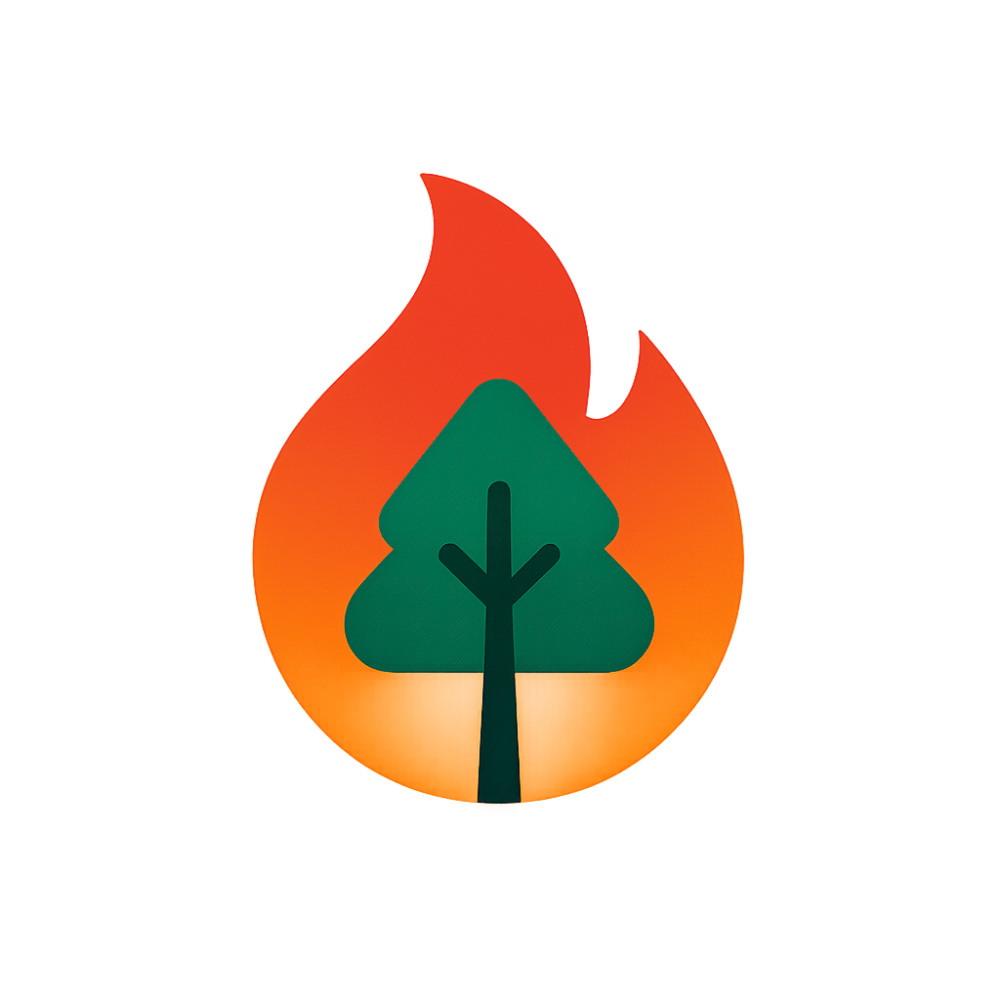

<div align="center>
  
  <h1>🔥 Fire Notification App</h1>
  <p>
    <b>Report wildfires and find emergency services nearby</b><br>
    
    
  </p>
</div>

---

## 🚀 Features

- Geolocate user and show current position on map
- Tap to mark a fire or incident location
- Search for nearby emergency services (firefighters, police, hospitals, civil protection)
- Adjustable search radius (1-20 km)
- View service details and call directly from the app
- Modern splash screen with custom logo

---

## 🛠️ Setup & Installation

1. **Clone the repository**
   ```sh
   git clone https://github.com/Fralopala2/fire_notification_app.git
   cd fire_notification_app
   ```
2. **Install dependencies**
   ```sh
   flutter pub get
   ```
3. **Run the app**
   ```sh
   flutter run
   ```

---

## 📱 Screenshots

<details>
  <summary>Click to expand!</summary>
  
  ### Splash Screen
  

  ### Home Screen
  

  ### Map Screen
  

  ### Service Details
  

</details>

---

## 📝 Notes

- This project is built using Flutter 3.9
- Android Emulator or a real device is required to test the app

---

## 🤝 Contributing

Contributions are welcome!

---

## 📄 License

This project is released for educational and personal use only. Commercial use, redistribution, or modification for profit is strictly prohibited without explicit written permission from the author. All rights reserved.

For more details, see the [LICENSE.md](LICENSE.md) file.

---

## 🔗 Acknowledgements

- Inspired by the need to report and manage wildfire incidents effectively
- Built with passion and dedication to help communities stay safe

---

## 📞 Contact

For any inquiries or feedback, please reach out:

<div align="center" dir="auto">
  <p dir="auto">
    <a href="https://www.linkedin.com/in/fmlalinked/" rel="nofollow">
      
    </a>
    <a href="mailto:pacoaldev@gmail.com" rel="nofollow">
      
    </a>
    <a href="https://github.com/Fralopala2/mi-portfolio" rel="nofollow">
      
    </a>
    <a href="https://discord.com/users/Melburnia#6832" rel="nofollow">
      
    </a>
    <a href="https://www.instagram.com/pac0l0pez/" rel="nofollow">
      
    </a>
  </p>
</div>  

<p align="center">
⭐ **Don't forget to star my projects if you like them!** and thanks for visiting this repo. 😄
</p>

<p align="center">

</p>
